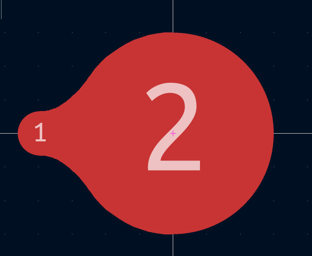

# kicad-nettie-generator

Генератор каплевидных **NetTie-2** footprint-ов для **KiCad 10** — плавный переход
между контактными площадками разных диаметров с расчётом геометрии по
**IPC-2221** (ток → сечение, напряжение → длина перехода).



Чистый Python 3.10+, без зависимостей. Не использует ни SWIG-биндинги,
ни IPC API — генерирует `.kicad_mod` напрямую, поэтому не зависит от судьбы
Python-обёрток KiCad и работает без установленного KiCad вообще.

## Зачем

Штатные NetTie из библиотеки KiCad — два пятачка одного диаметра с прямоугольной
перемычкой. Когда нужно перейти, например, с площадки 0.65 мм на 3 мм в силовой
цепи, прямоугольный мостик даёт концентрацию тока на углах стыка, а острые кромки
меди на высоком напряжении — точки концентрации поля и старта частичных разрядов.

Каплевидный контур решает обе проблемы: сечение меняется монотонно,
контур гладкий (G1) по всей длине, ширина «горла» гарантирована расчётом по току.

## Быстрый старт

1. Сгенерировать свой переход `NetTie`. Например:
```bash
(.venv) PS D:\Projects\Python\nettie_generator> python kicad_nettie_cli.py -v 12 -i 1.0 -d1 0.65 -d2 3.0 -t smd --tented
🔥 Смузи-парабола готова для KiCad 10!
==================================================
📦 Имя файла:    NetTie-2_SMD_D1-0.65_D2-3.00_L-3.80mm_Tented.kicad_mod
🔧 Тип монтажа:  SMD
📏 Физическая L: 3.80 мм
⚡ Узкое горло:  0.600 мм (IPC-минимум 0.300 × 2)
🌡  Непрерывно:   1.7 А при ΔT=10°C
💥 Плавление:    6 А/1с, 60 А/10мс, 602 А/100мкс
↔️  Зазор пад-пад: 0.150 мм (IPC-2221B ×1.5)
🎭 Маска:        закрыта (tented)
==================================================
💾 D:\Projects\Python\nettie_generator\NetTie-2_SMD_D1-0.65_D2-3.00_L-3.80mm_Tented.kicad_mod
```

2. Если нет, создать кастомную библиотеку посадочных мест. Например, `.../KiCad/Libraries/Custom_NetTies.pretty`
  KiCad => Редактор посадочных мест => Создать библиотеку => Custom_NetTie.pretty 
  Это директория, но её надо создавать именно в редакторе посадочных мест, иначе она не зарегистрируется. И обязательно шаблон имени должен содержать `pretty`: &lt;Name&gt;.pretty

3. Выбрать `Файл => Импорт => Посад. Место`

4. Найти сгенерированный файл, например `.../NetTie-2_SMD_D1-0.65_D2-3.00_L-3.80mm_Tented.kicad_mod`

5. Если всё устраивает, нажать `Сохранить` (`Ctrl+S`)

6. Будет предложено выбрать библиотеку. Выбираем созданную `Custom_NetTies`

Футпринт готов к использованию.

*Обратите внимание*: По умолчанию пады посадочных мест (1) и (2) открыты (открытые пятачки меди!) Поэтому, если делаете тип `SMD` лучше добавить ключ `--tented`.


## Параметры CLI

| Параметр | По умолчанию | Назначение |
|---|---|---|
| `-v, --voltage` | — | рабочее напряжение, В → зазор край-край (длина перехода) по IPC-2221B |
| `-i, --current` | — | максимальный ток, А (**RMS** для импульсных схем) → ширина горла по IPC-2221 |
| `-d1` | — | диаметр малого пада, мм |
| `-d2` | — | диаметр большого пада, мм |
| `-t, --type` | `smd` | тип монтажа: `smd` / `tht` |
| `-k, --neck-safety` | `2.0` | коэффициент запаса по ширине горла |
| `--safety` | `1.5` | коэффициент запаса по зазору |
| `--min-gap` | `0.15` | минимальный зазор край-край, мм |
| `--gap` | — | зазор вручную, мм (перекрывает расчёт по `-v`) |
| `--neck` | — | ширина горла вручную, мм (перекрывает расчёт по `-i`) |
| `--temp-rise` | `10.0` | допустимый перегрев меди, °C |
| `--copper` | `1.0` | толщина меди, oz |
| `--drill1`, `--drill2` | `d/2` | сверловка для THT, мм |
| `--tented` | выкл. | закрыть пады паяльной маской (без выреза) |
| `--points` | `48` | число точек на половину контура |
| `-o, --outdir` | `.` | каталог для сохранения |

Формат имени результата:

```
NetTie-2_SMD_D1-0.65_D2-3.00_L-3.80mm[_Tented].kicad_mod
```

## Физика

**Горло по току (IPC-2221, внешний слой):**

```
I = 0.048 · ΔT^0.44 · A^0.725        A — сечение в мил²
```

Из тока и допустимого перегрева вычисляется минимальная ширина меди,
затем умножается на запас `-k` (по умолчанию ×2 — компенсация недотрава,
RMS импульсных токов и термоциклирования).

**Зазор по напряжению (IPC-2221B, колонка B2 — внешний слой без покрытия):**
табличное значение × `--safety`. Электрически цепи через net-tie соединены,
поэтому зазор здесь задаёт не изоляцию, а длину плавного перехода:
выше напряжение → длиннее и плавнее капля.

**Справочно — ток плавления (формула Ондердонка):** сводка показывает ток
разрушения горла за 1 с / 10 мс / 100 мкс. Для импульсных применений
(HiPIMS и т.п.) выбирайте `-i` по RMS-току: одиночный импульс горло
не убивает, убивает средний нагрев.

## Геометрия

Контур — парабола с вершиной у малого пада:

```
f(x) = h + a·(x + C)²,   h = max(neck/2, r1)
```

* Вершина лежит **не ниже верхушки малой окружности**, поэтому кривая
  касается её в вершине (наклоны обеих кривых нулевые) — стык G1-гладкий,
  «зазубрины» от пересечения окружности под углом исключены геометрически.
* Точка касания большой окружности находится бисекцией из аналитического
  условия касания `f(xt) = √(r2²−xt²)`, `f'(xt) = −xt/yt`; дальше контур
  идёт по дуге самой окружности — излом в стыке невозможен.
* Если ток требует горло шире малого пада (`neck > d1`), контур замыкается
  полукруглой шапкой и выводится предупреждение: проверьте ширину
  подходящей дорожки.

Полная длина футпринта: `L = d1 + d2 + gap`.

## Архитектура

```
kicad_nettie_cli.py        CLI: argparse, оркестровка, сводка
ipc_calc.py                физика: IPC-2221, зазоры, Ондердонк
geometry.py                математика: контур капли
template.py                рендер: подстановка полей в шаблон
nettie_template.kicad_tpl  все поля footprint-а (текстовый шаблон)
```

Модули не зависят друг от друга (`ipc_calc` и `geometry` — чистые функции),
поэтому их можно дёргать из своих скриптов или будущего IPC-плагина KiCad:

```python
import geometry, ipc_calc, template

neck = ipc_calc.ipc_neck_width_mm(current_a=1.0) * 2
poly = geometry.teardrop_polygon(r1=0.325, r2=1.5, center_dist=1.975, neck=neck)
text = template.render_footprint("MyNetTie", 0.65, 3.0, 0.15, neck,
                                 "smd", 0.325, 1.5, poly)
```

## Важные атрибуты сгенерированного footprint-а

* `net_tie_pad_groups "1,2"` — разрешение DRC на соединение разных цепей
  (вкладка *Свойства → Подкл. к конт. пл. → Связки цепей*);
* `exclude_from_pos_files exclude_from_bom` — футпринт не попадает
  в BOM и pos-файлы;
* courtyard (F.CrtYd, медь + `--courtyard-margin`, по умолчанию 0.25 мм) —
  нужен для локальных DRC-правил, см. ниже;
* пады без `F.Paste` — паста на net-tie не наносится;
* `--tented` убирает `F.Mask`/`*.Mask` — маска закрывает пады
  (для THT закрывается только кольцо, ствол отверстия физически не тентуется).

## Подключение тонкой цепи при большом зазоре netclass

Если «толстая» цепь имеет зазор netclass больше, чем расстояние от пада 1
до тела капли, дорожка не сможет подойти к паду. Правильное решение —
локальное DRC-правило, привязанное к courtyard конкретной связки
(*Файл → Параметры платы → Собственные правила*):

```lisp
(rule "NetTie_NT1_local"
   (condition "A.intersectsCourtyard('NT1') && B.intersectsCourtyard('NT1')")
   (constraint clearance (min 0.15mm)))
```

или для всех элементов, начинающихся с `NT*`

```lisp
(rule "NetTie_All_Universal_Courtyard"
   (condition "A.insideCourtyard('NT*') || B.insideCourtyard('NT*')")
   (constraint clearance (min 0.15mm)))
```


Правило действует только внутри courtyard футпринта `NT1`, переезжает вместе
с ним и не ослабляет зазоры цепей на остальной плате. Глобальное правило по
паре имён цепей (`A.NetName == ... && B.NetName == ...`) использовать не стоит:
оно срабатывает везде, где эти цепи соседствуют, и заливка «толстой» цепи
подползёт к сигнальной дорожке по всей плате.


## Ограничения и здравый смысл

* IPC-2221 рассчитан на длинную дорожку; короткое горло между двумя медными
  пятаками охлаждается лучше, так что расчёт консервативен — но запас `-k 1`
  ставьте осознанно.
* Паяльная маска — не изоляционный барьер: creepage считайте так, будто её нет.
* Для измерительных связок (кельвин на шунте, звезда GND) капля не нужна —
  используйте минимальный симметричный мостик: `--neck 0.3 --gap 0.3 -d2 0.65`.

## Лицензия

MIT
